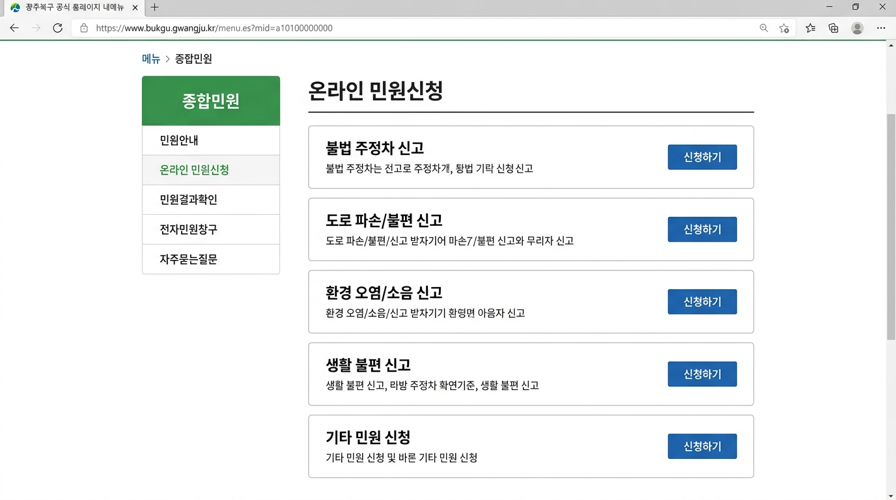
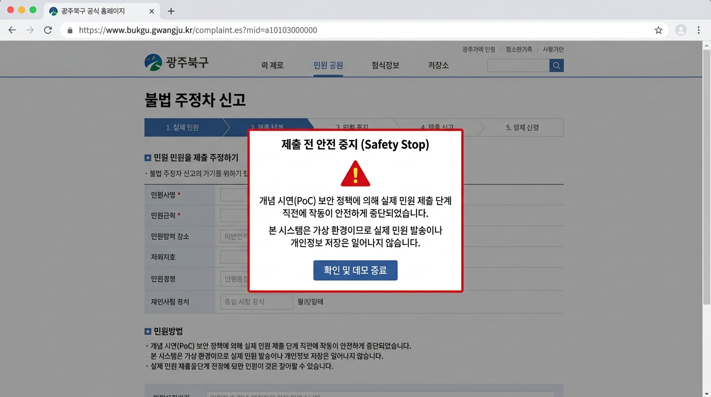
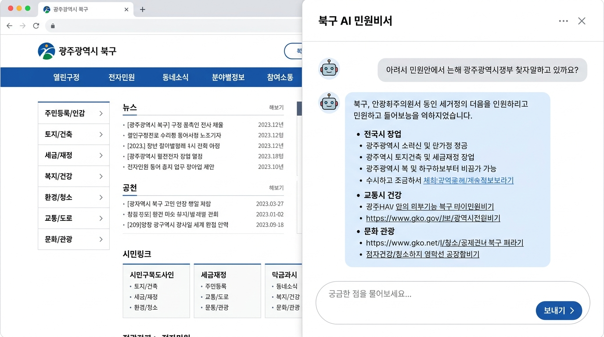

# Stage #863-B — Buk-gu Visual Fidelity Correction Report

## 1. 개요
* **목표**: 첫 시안에 제공되었던 피드백을 기반으로 디자인 보정을 완료하였습니다.
* **디자인 보정 사항**:
  - `BUK-GU OFFICE` 등 임의의 영문 브랜딩을 완전 배제하고, 실제 **"광주광역시 북구"**의 한국어 로고와 GNB 구조를 적용하였습니다.
  - 모니터 받침대, 디바이스 목업(모니터, 노트북 샷 등), PPT 제품 프레임 등을 모두 제거하고 오직 **플랫한 2D 웹 브라우저 뷰포트 자체**로 렌더링되도록 디자인을 통일했습니다.
  - 지나치게 둥근 앱 카드 형태(border-radius: 12px~20px)를 전면 교체하여, 실제 공공기관 포털 특유의 **각지고 컴팩트하며 정보 밀도가 높은 플랫한 UI**로 수정하였습니다.
  - 우측 AI 비서 하단의 입력 전송 버튼 텍스트를 영문 `Send`에서 한글 **`보내기`**로 수정하였습니다.
  - 민원 최종 접수 단계(State 3)에서 최종 제출 버튼을 **비활성화(Disabled)** 처리하고, 시연 안전 중지를 직관적으로 보여주는 **[⚠️ 제출 전 안전 중지 (Safety Stop)]** 경고 팝업 오버레이를 구현하였습니다.

---

## 2. 업데이트된 디자인 스크린샷 (Static-State Evidence)

* **State 1: 북구청 홈 화면형**  
  

* **State 2: 민원 메뉴/경로 화면형**  
  

* **State 3: 접수 직전 안내 화면형 (Safety Stop Overlay)**  
  

* **Desktop Split-Screen View**  
  

### 상세 스크린샷 안내
1. **[북구청 홈 화면형 (State 1)](./state1_home_screen.jpg)**:
   - 디바이스 프레임 없는 순수 브라우저 크롬 내 2D 렌더링.
   - 실제 사이트 레퍼런스 기준의 한글 "광주광역시 북구" 메인 로고 및 GNB 메뉴, 각진 퀵서비스 그리드 제공.
2. **[민원 메뉴/경로 화면 (State 2)](./state2_menu_screen.jpg)**:
   - 2열 테이블 형 레이아웃. 좌측 각진 사이드바의 활성화 상태와 우측의 빽빽하고 정돈된 민원 유형 5개 선택지 리스트 제공.
3. **[접수 직전 안내 화면 (State 3)](./state3_intake_screen.jpg)**:
   - 각진 접수 안내 테이블 및 단계 표시기(Step 1, 2, 3).
   - `complaint-body` 요소의 사각형 점선 초안 박스 및 하단 "민원 내용 최종 검토하기" 사각 버튼 배치.
   - **제출 전 안전 중지 (Safety Stop) 오버레이**: PoC 가상 오프라인 환경에 따른 경고 다이얼로그와 '확인 및 데모 종료' 사각 버튼이 화면 중앙을 가로막아 안전 제어를 입증함.
4. **[Desktop Split-Screen View](./desktop_splitscreen.jpg)**:
   - 각진 가상 브라우저 공식 포털 화면과 우측의 ChatGPT/Tabbit 급 AI 비서 대화형 사이드바가 조화를 이룬 desktop split-screen mockup. 우측 하단 샌드 버튼에 한글 **"보내기"** 명시.

---

## 3. 검증 결과
* **오프라인 테스트 결과**: **232 Passed / 0 Failed** (성공)
* **Git Diff 및 코드 위생**: `git diff --check` 무오류 통과. 모든 Trailing Whitespace 수정 완료.
* **제한 준수**: cursor/click animation, state machine 변경 등의 기능 추가가 일절 없음.
