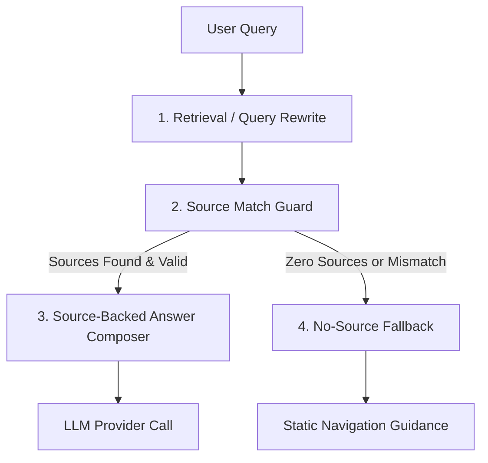

# No-Source Fallback Scope and Rule-Expansion Policy

## 1. Purpose

The purpose of this document is to define the boundary, safety guidance rules, and limits of the no-source fallback mechanism in the `400-ai-finder` system. 

The no-source fallback is a safety guardrail—not an LLM-based answer composer or a hardcoded fact database. As the project handles volatile public-sector information (such as mayor names, contact numbers, and office locations), hardcoding facts into fallback rules presents a severe risk of turning the conversational retrieval-augmented generation (RAG) system into a brittle, hardcoded program (rule-expansion drift). This policy defines what the fallback mechanism may do, what it must never do, and how responsibilities are separated to prevent logic drift.

---

## 2. Current Behavior After Stage 378

Following the merge of PR #700 (Stage 378), the fallback behavior was refined as follows:
- When the search step retrieves no official sources (or all retrieved sources are rejected by the query-source relevance check), the pipeline short-circuits.
- Instead of calling an LLM provider (e.g., via `provider.complete()`), the system invokes `_build_no_source_guidance()` in [answer_composer.py](file:///mnt/g/Ddrive/BatangD/task/workdiary/400-ai-finder/src/answer/answer_composer.py#L278-L317).
- This method maps broad keyword patterns in the query to a pre-defined set of Korean public-sector navigation/menu recommendations (e.g., `구청장실`, `조직도`, `오시는 길`).
- The returned response contains the warnings `["no search results", "no_source_guidance"]`, has `provider="none"`, `guard_status="no_results"`, and includes `query_hints`.

---

## 3. What No-Source Fallback May Do

The fallback guidance is allowed to perform a very narrow set of safety actions:
1. **Provide navigation hints**: Return generic, stable menu names on the official website (e.g., "조직도", "오시는 길", "종합민원") where the user might find the answer.
2. **Warn the user clearly**: State that the relevant evidence could not be found in the current crawled official sources.
3. **Prompt for search refinement**: Recommend that the user search using different keywords or consult the official website's integrated search menu directly.
4. **Log fallback events**: Return structured status flags (`guard_status="no_results"`, `fallback_used=True` or `warnings` indicators) to allow operators to run retrieval gap analytics and trace search failures.

---

## 4. What No-Source Fallback Must Never Do

To preserve the RAG-first architecture, the fallback path is bound by the following negative constraints:
1. **No Provider Calls**: It must **never** call `provider.complete()` or execute LLM calls without grounded sources.
2. **No Volatile Fact-Hardcoding**: It must **never** contain hardcoded facts that are prone to change. Examples include:
   - Names of public officials (e.g., mayors, district heads, team leaders).
   - Phone numbers, email addresses, or specific department designations.
   - Office locations, specific desk numbers, or parking fees.
   - Operating hours, specific application schedules, fee structures, or policy eligibility criteria.
3. **No Stale or Unrelated Document Reuse**: It must **never** compose an answer using low-confidence or unrelated documents.
4. **No Automated State Changes**: It must **never** automatically promote queries to scenario caches or trigger system state mutations.

---

## 5. Rule-Expansion Drift Risks

Rule-expansion drift occurs when developers continuously append specific condition clauses to bypass retrieval failures.
```
User asks: "구청장 누구야?"  ──> Search fails ──> Fallback hardcodes: "문인입니다." (DRIFT!)
User asks: "전화번호 뭐야?"  ──> Search fails ──> Fallback hardcodes: "062-410..."  (DRIFT!)
```

### Risks of Rule-Expansion Drift:
- **Maintenance Nightmare**: Public-sector details change constantly. Hardcoding them leads to silent stale answers when officials change or office phone lines are re-routed.
- **Architectural Regression**: The product ceases to be a dynamic RAG explorer and becomes a static, button-driven FAQ tree.
- **Hidden Retrieval Gaps**: Hardcoded fallbacks mask underlying search index failures, keyword synonym gaps, or crawler issues, preventing the core search engine from being improved.

---

## 6. Responsibility Split

To keep the system modular and maintainable, responsibilities are clearly partitioned:



### 1. Retrieval & Query Rewrite
- **Role**: Normalize the query, strip Korean particles, expand synonym terms (e.g., mapping `구청장` to `북구청장 소개`), and locate relevant candidate documents from the index/crawled site.
- **Policy**: If a user asks a question and the system fails to find official sources, the solution must be implemented here (e.g., enriching synonym dictionaries, updating crawl snapshots) rather than writing custom fallback response rules.

### 2. Source Match Guard
- **Role**: Inspect the retrieved sources against the user query to ensure the documents are actually related and not stale or mismatched.
- **Policy**: Must strictly block composition if the semantic alignment is low. It triggers the `no_results` state to prevent hallucination.

### 3. Source-Backed Answer Composer
- **Role**: Send the valid, grounded sources and the user query to the LLM provider to construct a dynamic, citation-linked markdown answer.
- **Policy**: It is only active when official sources are present. It is the only path that calls LLM completion.

### 4. No-Source Fallback
- **Role**: Accept the query when search yields zero sources and render a safe, static navigation help panel.
- **Policy**: Must remain fully deterministic and provider-free. It uses generic buckets only.

---

## 7. Allowed Generic Menu Hint Buckets

The system defines only the following five generic menu buckets in [answer_composer.py](file:///mnt/g/Ddrive/BatangD/task/workdiary/400-ai-finder/src/answer/answer_composer.py):

| Category | Keywords | Allowed Menu Hints |
| :--- | :--- | :--- |
| **Mayor / Leadership** | `구청장`, `기관장`, `mayor`, `총장`, `국장` | `구청장실`, `기관장 소개`, `인사말` |
| **Staff & Contacts** | `담당자`, `연락처`, `전화번호`, `부서`, `담당`, `contact` | `조직도`, `직원검색`, `부서안내` |
| **Location & Parking** | `주차`, `위치`, `오시는 길`, `주소`, `parking`, `오시는길` | `청사안내`, `오시는 길`, `주차안내` |
| **Civil Service & Forms** | `민원`, `신청`, `서식`, `접수`, `양식`, `form` | `민원`, `민원서식`, `신청/접수`, `자주찾는 서비스` |
| **Default Fallback** | *Any unrecognized queries* | `홈페이지 통합검색`, `관련 메뉴` |

---

## 8. Disallowed Examples

The following code snippets illustrate patterns that violate the rule-expansion policy and must not be merged:

### Violation 1: Hardcoding specific facts in fallback logic
```python
# VIOLATION: Hardcoding volatile administrative facts
if "구청장" in query:
    return {
        "answer_markdown": "광주 북구청장은 문인 구청장입니다.", # Hardcoded fact!
        "sources": []
    }
```

### Violation 2: Hardcoding specific department phone numbers
```python
# VIOLATION: Hardcoding contact info
if "세무" in query and "전화" in query:
    return {
        "answer_markdown": "세무1과 전화번호는 062-410-7352 입니다.", # Hardcoded fact!
        "sources": []
    }
```

### Violation 3: Calling LLM without source context
```python
# VIOLATION: Bypassing source grounding by calling LLM freely
if not sources:
    # This leads to ungrounded LLM hallucinations on public sector data!
    response = provider.complete(prompt=f"Answer this query: {query}")
    return response
```

---

## 9. Future Improvement Path

Rather than expanding the fallback conditional branches, future efforts to resolve `no_results` errors should target:
1. **Synonym Matching**: Maintain and update site-specific synonym files under `configs/sites/` (e.g., mapping localized administrative slang to standardized menu paths).
2. **Query Normalization**: Improve particle removal and structural parsing of Korean questions in the query rewriter.
3. **Retrieval Precision**: Implement hybrid keyword and semantic ranking configurations to ensure official documents are found even if keywords do not match exactly.
4. **Targeted Crawling**: Ensure snapshot files contain representative index structures of target pages (e.g., ensuring organizational hierarchy pages are correctly crawled and indexed).

---

## 10. Recommended Next Stage

To ensure that the query rewriter is properly communicating with the retrieval pipeline and mapping volatile public-sector questions correctly, we propose the following next stage:

* **Stage Title**: `[AUDIT] Inspect query rewrite to retrieval integration for public-sector volatile questions`
* **Objective**: Evaluate how queries regarding volatile topics (e.g., mayor, department contact info, parking) are rewritten and whether these rewritten query variations successfully fetch target index pages in the offline validation matrix. Ensure no queries leak empty results because of synonym gaps or integration mismatches.
